# Ejercicio de Instalación de Apache Spark en una Máquina Virtual de Azure

Este ejercicio tiene como objetivo crear e instalar **Apache Spark** en una **máquina virtual (VM) independiente** en **Azure**, utilizando un sistema operativo **Linux (Ubuntu)**. A lo largo del ejercicio, se aprenderán los pasos necesarios para configurar la máquina virtual, instalar Apache Spark y ejecutarlo en un entorno local.

   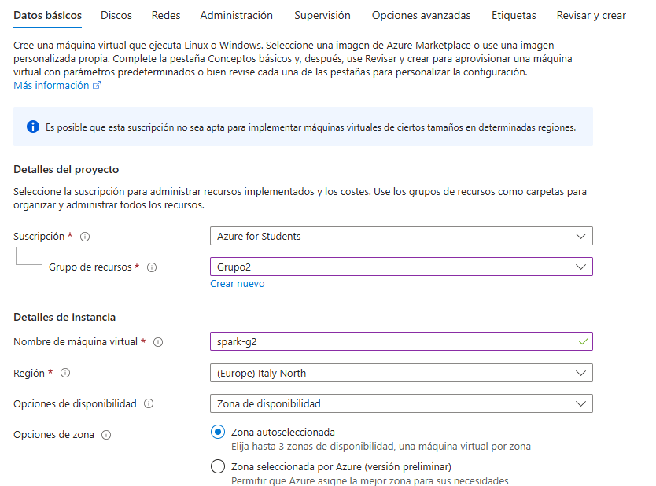
   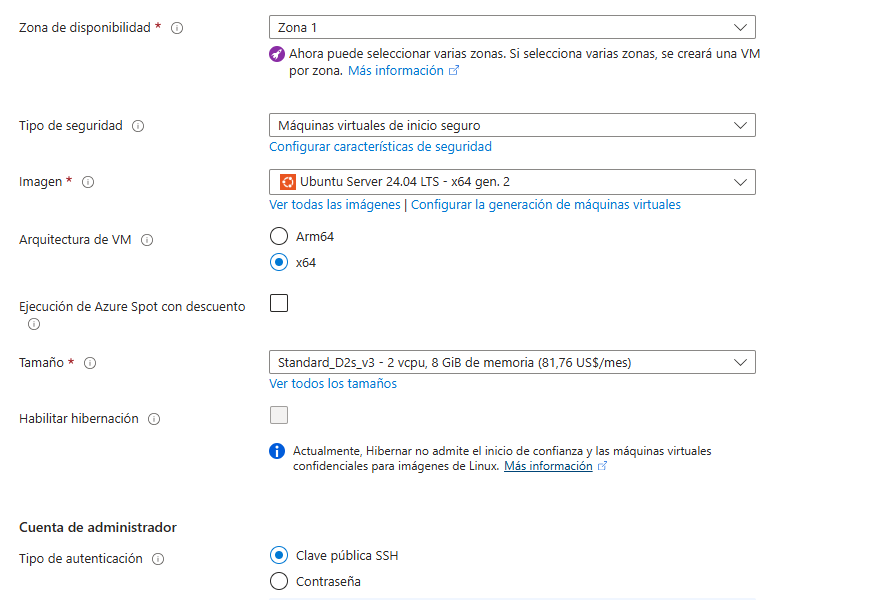
   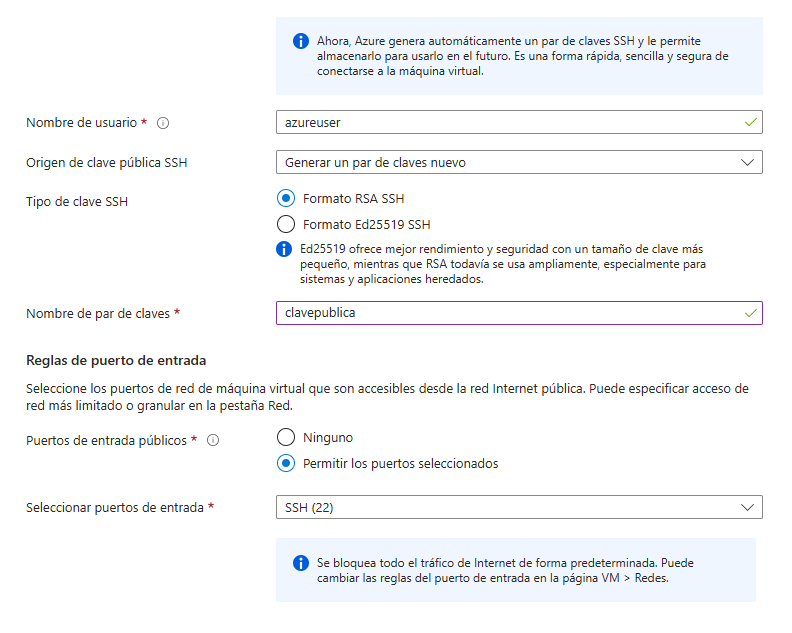
   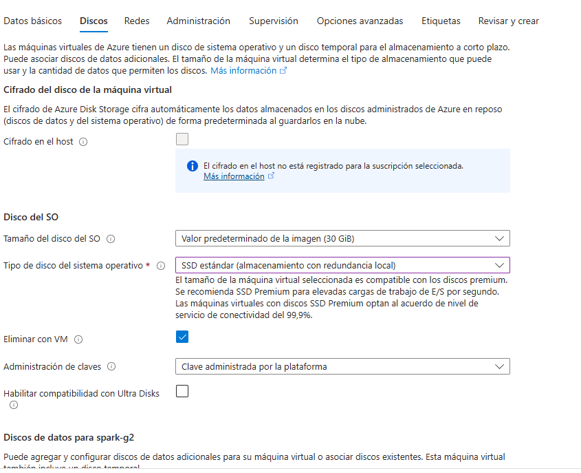
   Lo demas lo dejamos como esta...

Para ello, nos conectamos a la MV con SSH desde nuestra consola local con gracias a las claves:
```bash
ssh -i "<ruta_a_clavepublica>" <usuario>@<ip_pública>
```
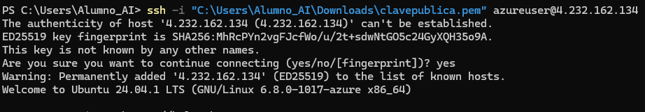
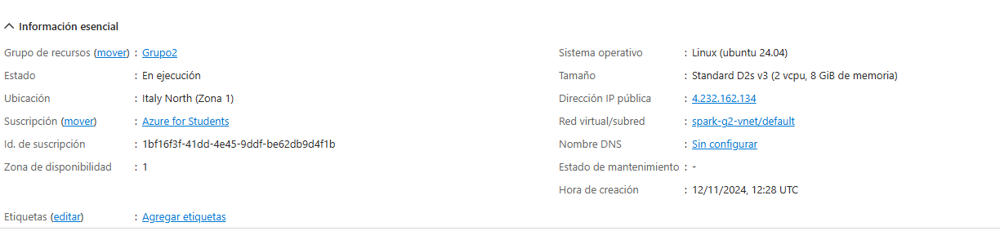
Instalamos Java
```bash
sudo apt update
sudo apt install openjdk-8-jdk
```
Comprobamos que se haya instalado bien:
```bash
java -version 
```
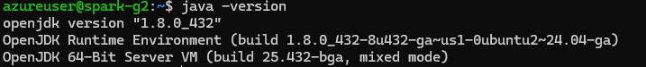
Ahora python
Primero comprobamos si esta instalado
```bash
python --version
```
Si no sale nada, no esta instalado, entonces haremos lo siguiente:
```bash
sudo apt install python3
```

Para descargar spark, vamos a la página de spark para obtener el enlace de la descarga .tgz 
Para descargar spark usamos este comando:
```bash
wget https://downloads.apache.org/spark/spark-3.5.3/spark-3.5.3-bin-hadoop3.tgz
```
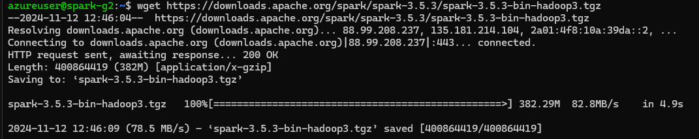
lo probamos poniendo:
```bash
pyspark
```
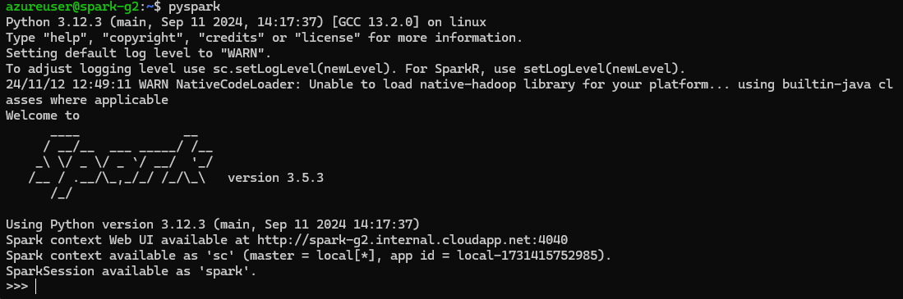
o viendo scala con:
```bash
spark-shell
```
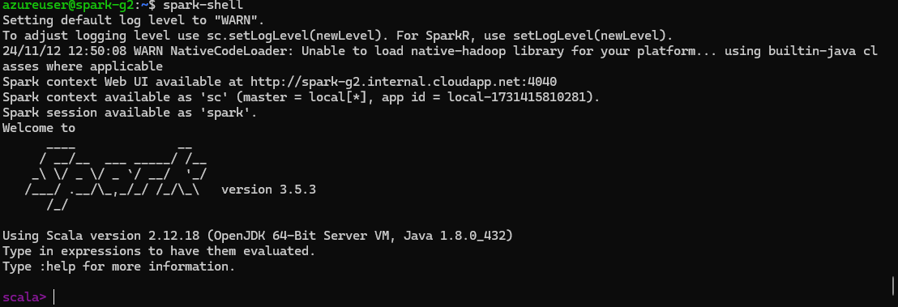
lo descomprimimos:
```bash
tar -xvf spark-3.5.3-bin-hadoop3.tgz
```
y comprobamos con:
```bash
 ls
```
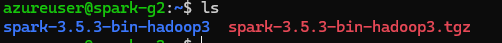
movemos los archivos a la carpeta /opt/spark y lo comprobamos 
```bash
 sudo mv spark-3.4.5-bin.hadoop3 /opt/spark
 ls /opt/spark
```
 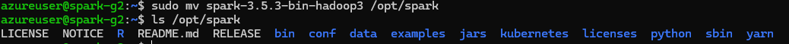
editamos el archivo ~/.bashrc para añadir variables de entorno de esta manera:
```bash
nano ~/.bashrc
```
Añadimos lo siguiente dentro del archivo:
 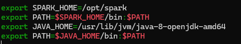

Estamos añadiendo la ruta de Spark principal, y la de Java principal
Para guardar los cambios hacemos source ~/.bashrc

Por ultimo paramos y eliminamos la maquina virtual:
 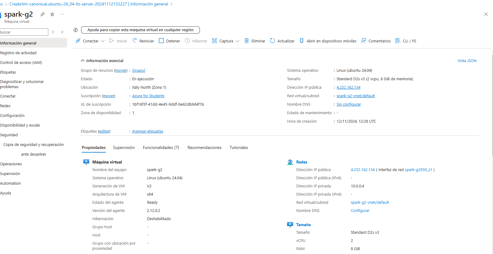
 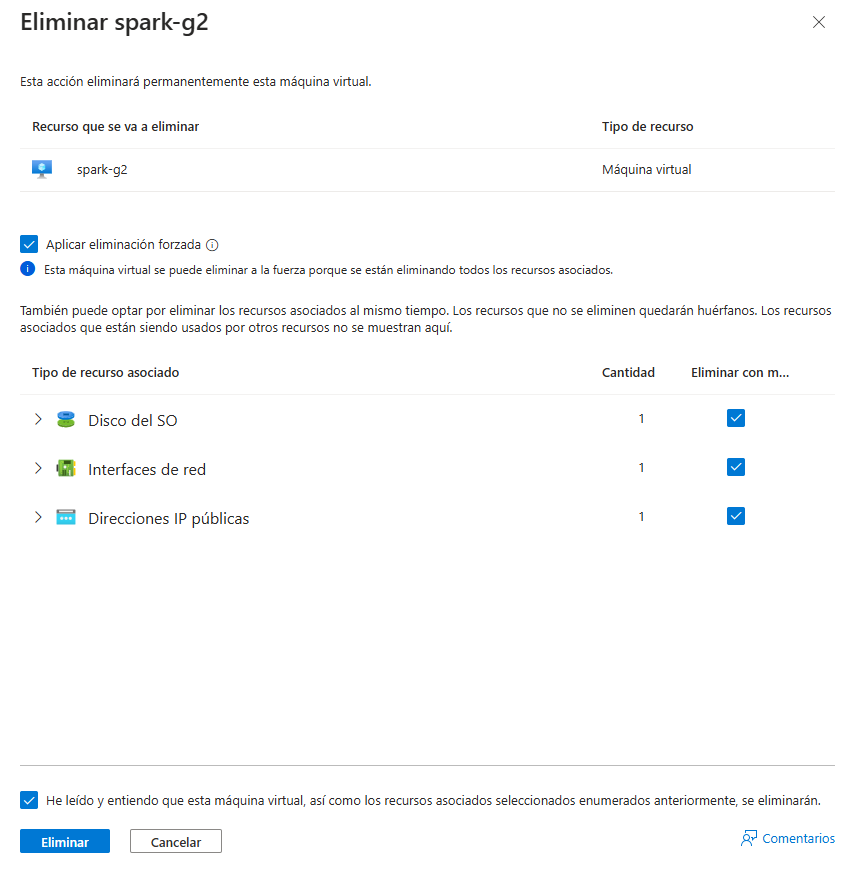


